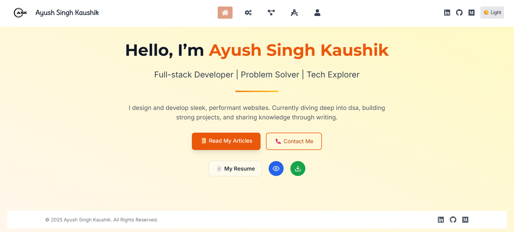
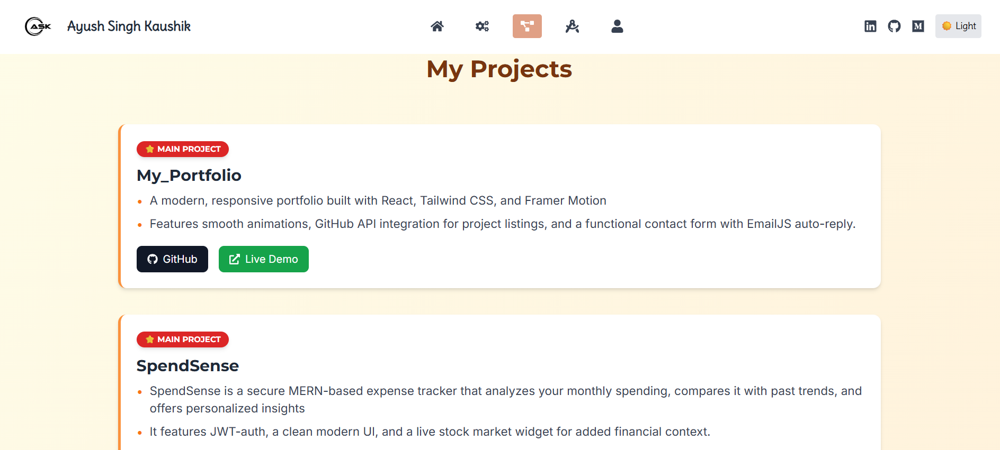

# 💼 Ayush Singh Kaushik - Developer Portfolio



Welcome to my personal developer portfolio! This project showcases my skills, projects, and journey as a web developer — built using modern technologies and optimized for performance, accessibility, and mobile responsiveness.

🌐 **Live Website:**
🔗 [ayushsinghkaushik-portfolio.netlify.app](https://ayushsinghkaushik-portfolio.netlify.app/)

---

## ✨ Tech Stack

* **Frontend**: React.js + Tailwind CSS
* **Routing**: React Router DOM
* **Animations**: Framer Motion
* **Contact Form**: EmailJS (2-way integration: forward + auto-reply)
* **API Integration**: GitHub REST API
* **Deployment**: Netlify

---

## 📝 Key Features

* ✨ Sleek, modern, and responsive UI
* 🌌 Animated section transitions
* 💡 Light/Dark mode toggle
* 🔍 GitHub Projects auto-fetched and displayed
* 📨 Contact form with auto-reply using EmailJS
* 🚀 Deploy-ready and mobile-optimized

---

## 📸 Screenshots

| Home                                                                                   | Skills                                                                                   | Projects                                                                                   |
| -------------------------------------------------------------------------------------- | ---------------------------------------------------------------------------------------- | ------------------------------------------------------------------------------------------ |
|  |  |  |

---

## 🛠️ Getting Started

Clone the repository and start the development server:

```bash
git clone https://github.com/ASK3002/My_Portfolio.git
cd My_Portfolio
npm install
npm run dev
```

> Make sure to configure your `.env` or `emailjs` credentials for contact form to work.

---

## 📢 Contact Me

* Email: [ayushinghkaushik111@gmail.com](mailto:ayushinghkaushik111@gmail.com)
* GitHub: [@ASK3002](https://github.com/ASK3002)
* LinkedIn: [linkedin.com/in/ayush-singh-kaushik](https://www.linkedin.com/in/ayush-singh-kaushik)

---

## 📃 License

This project is licensed under the [MIT License](LICENSE).

---

🌟 Designed and developed with care by **Ayush Singh Kaushik**.
